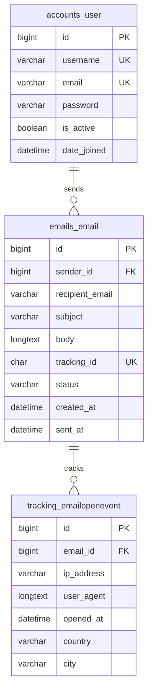
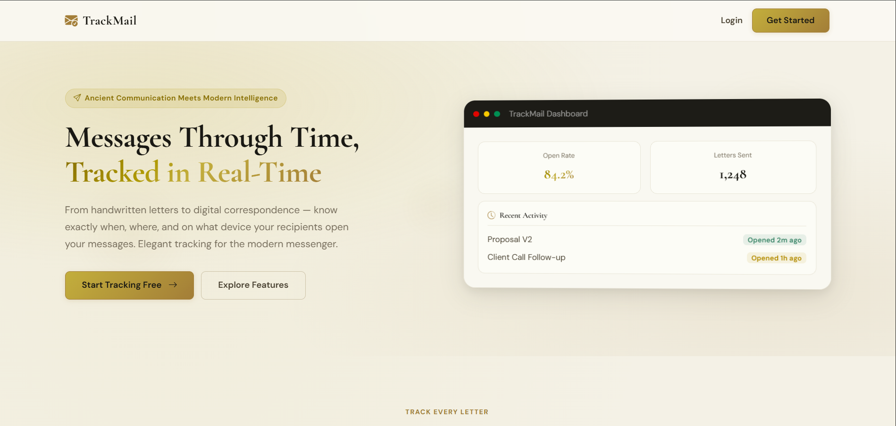
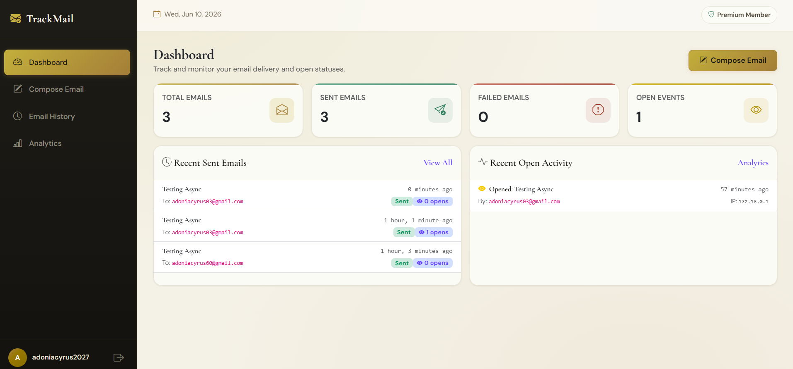
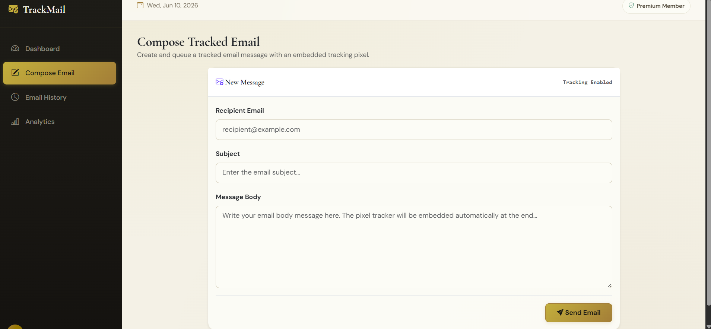
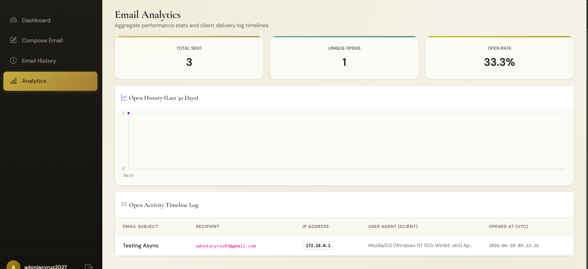
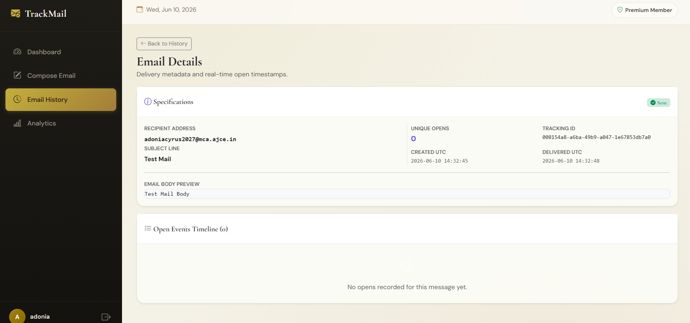

<div align="center">

# 📧 TrackMail

### Modern SaaS Email Tracking Platform


<br>

### 🚀 Live Demo

https://trackmail.adoniacyrus.com/

### 💻 GitHub Repository

https://github.com/adoniacyrus/TrackMail

</div>

---

# 📌 Project Overview

TrackMail is a modern SaaS-style email tracking platform that enables users to:

* 📩 Send trackable emails
* 🖼️ Inject invisible tracking pixels into emails to detect real-time email opens
* 📊 Monitor email opens in real time
* ⚡ Process emails asynchronously using Celery
* 🔐 Manage user-specific dashboards securely
* ☁️ Run production-style cloud deployment using Docker & Azure

The platform demonstrates real-world implementation of:

* Full Stack Web Development
* Async Task Queues
* Dockerized Deployment
* Email Tracking Systems
* Reverse Proxy Architecture
* Cloud Hosting Workflows

---

# ✨ Key Features

## 🔐 Authentication System

* User Registration
* Login & Logout
* Session-based Authentication
* Protected Dashboard Routes

## 📧 Email Tracking

* Tracking Pixel Integration
* Real-time Open Tracking
* Email Open Analytics
* Delivery Status Monitoring

## 📊 SaaS Dashboard

* Modern Bootstrap 5 Dashboard
* Analytics Cards
* Email Activity Tracking
* Responsive UI

## ⚡ Async Processing

* Celery Workers
* Redis Queue Management
* Non-blocking Email Delivery

## ☁️ Production Deployment

* Dockerized Infrastructure
* Azure VM Deployment
* Nginx Reverse Proxy
* Gunicorn WSGI Server

---

# 🛠 Core Technologies Implemented

<table>
<tr>
<td valign="top" width="50%">

## Backend

* Django 5
* Django ORM
* Django Authentication
* Celery Task Queue

## Frontend

* Django Templates
* Bootstrap 5
* HTML5
* CSS3
* JavaScript
* AJAX

</td>

<td valign="top" width="50%">

## Infrastructure

* Docker
* Docker Compose
* Nginx
* Azure VM

## Database & Queue

* MySQL
* Redis

## Email Infrastructure

* SMTP Integration
* Tracking Pixel System
* Email Analytics

</td>
</tr>
</table>

---

# 🏗 System Architecture

```text
User Browser
      ↓
Nginx Reverse Proxy
      ↓
Django Application
      ↓
Celery Async Worker
      ↓
Redis Queue
      ↓
SMTP Mail Server
      ↓
Recipient Inbox
      ↓
Tracking Pixel Request
      ↓
Analytics Stored in MySQL
```

---

# 🗄 Database Schema

## 📌 Core Relationship Design
* One User → Many Emails
      - Each authenticated user can create and manage multiple trackable emails while maintaining strict ownership isolation.
* One Email → Many Tracking Events
      - Every sent email can generate multiple tracking events such as email opens, allowing real-time engagement analytics.
* Many Tracking Events → One Email
      - Multiple open events are associated with a single email record through foreign key relationships for accurate tracking history.
* One Tracking Pixel → One Email
      - Each email contains a unique invisible tracking pixel used to detect when recipients open the email.

TrackMail utilizes a relational MySQL schema designed to support:

* Multi-user SaaS architecture
* Email ownership isolation
* Real-time analytics
* Async processing compatibility
* Tracking event storage

## 📌 Entity Relationship Diagram



---

# 📸 Application Screenshots

## 🏠 Landing Page



Path:

```text
TrackMail/screenshots/landing.png
```

---

## 📊 Dashboard



Path:

```text
TrackMail/screenshots/dashboard.png
```

---

## ✉️ Compose Email



Path:

```text
TrackMail/screenshots/compose.png
```

---

## 📈 Analytics



Path:

```text
TrackMail/screenshots/analytics.png
```

---

## 📄 Email Details



Path:

```text
TrackMail/screenshots/email_detail.png
```

---

# 📁 Recommended Repository Structure

```text
TrackMail/
│
├── backend/
│
├── screenshots/
│   ├── landing.png
│   ├── dashboard.png
│   ├── compose.png
│   ├── analytics.png
│   └── email_detail.png
│
├── README.md
│
└── docker-compose.yml
```

---

# ⚙️ Installation Guide

## 1️⃣ Clone Repository

```bash
git clone https://github.com/YOUR_USERNAME/TrackMail.git
cd TrackMail/backend
```

---

## 2️⃣ Create Environment File

Create a `.env` file inside:

```text
TrackMail/backend/.env
```

Example:

```env
SECRET_KEY=your_secret_key

DEBUG=True

DB_NAME=trackmail
DB_USER=root
DB_PASSWORD=rootpassword
DB_HOST=db
DB_PORT=3306

EMAIL_HOST=smtp.gmail.com
EMAIL_PORT=587

EMAIL_HOST_USER=your_email@gmail.com
EMAIL_HOST_PASSWORD=your_app_password

DEFAULT_FROM_EMAIL=your_email@gmail.com

CELERY_BROKER_URL=redis://redis:6379/0

EMAIL_USE_TLS=True

ALLOWED_HOSTS=127.0.0.1,localhost

SITE_URL=http://127.0.0.1
```

---

## 3️⃣ Build Docker Containers

Run from:

```text
TrackMail/backend/
```

Command:

```bash
docker compose up -d --build
```

---

## 4️⃣ Apply Database Migrations

```bash
docker compose exec web python manage.py migrate
```

---

## 5️⃣ Create Superuser

```bash
docker compose exec web python manage.py createsuperuser
```

---

## 6️⃣ Collect Static Files

```bash
docker compose exec web python manage.py collectstatic --noinput
```

---

## 7️⃣ Run Application

Open:

```text
http://127.0.0.1
```

---

# 🐳 Docker Services

| Service | Purpose            |
| ------- | ------------------ |
| web     | Django Application |
| nginx   | Reverse Proxy      |
| db      | MySQL Database     |
| redis   | Message Broker     |
| celery  | Background Worker  |

---

# ☁️ Deployment

TrackMail is deployed using:

* Azure Virtual Machine
* Dockerized Infrastructure
* Gunicorn WSGI Server
* Nginx Reverse Proxy
* Redis Queue
* Celery Workers

### 🌐 Live URL

https://trackmail.adoniacyrus.com/

---

## Current Email Infrastructure

TrackMail currently uses a centralized SMTP configuration for development and demonstration purposes.

All outgoing emails are routed through a single SMTP provider account configured via environment variables.

Future enhancements may include:
- Per-user SMTP integration
- OAuth-based provider connections
- SMTP isolation per workspace/user
- Rate limiting and abuse prevention
